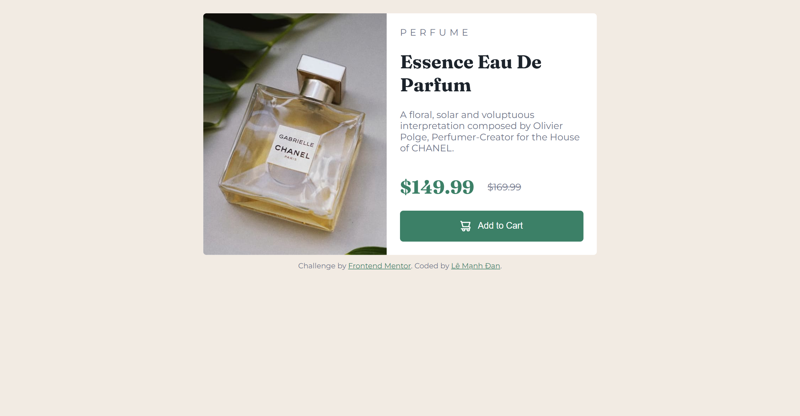

# Frontend Mentor - Product preview card component solution

This is a solution to the [Product preview card component challenge on Frontend Mentor](https://www.frontendmentor.io/challenges/product-preview-card-component-GO7UmttRfa). Frontend Mentor challenges help you improve your coding skills by building realistic projects. 

## Table of contents

- [Overview](#overview)
  - [The challenge](#the-challenge)
  - [Screenshot](#screenshot)
  - [Links](#links)
- [My process](#my-process)
  - [Built with](#built-with)
  - [What I learned](#what-i-learned)
  - [Continued development](#continued-development)
  - [Useful resources](#useful-resources)
- [Author](#author)
- [Acknowledgments](#acknowledgments)

## Overview

### The challenge

Users should be able to:

- View the optimal layout depending on their device's screen size
- See hover and focus states for interactive elements

### Screenshot



### Links

- Solution URL: https://github.com/DanKRT-Star/product-preview-card-component-main
- Live Site URL: https://product-preview-card-component-main-two-omega.vercel.app/

## My process

### Built with

- Semantic HTML5 markup
- CSS custom properties
- Flexbox
- Mobile-first workflow

### What I learned

During this project, I learned how to use the <picture> element for responsive images, apply Flexbox for layout, and utilize CSS custom properties for consistent theming. I also practiced mobile-first design and improved my understanding of accessibility for interactive elements.

```html
<picture>
  <source srcset="./images/image-product-desktop.jpg" media="(min-width: 470px)">
  
</picture>
```

```css
.preview-card {
  display: flex;
  max-width: 590px;
}
```

### Continued development

In future projects, I want to focus more on accessibility, advanced CSS techniques (like grid and animations), and optimizing images for performance.

### Useful resources

- [MDN Web Docs - Responsive images](https://developer.mozilla.org/en-US/docs/Learn/HTML/Multimedia_and_embedding/Responsive_images) - Helped me understand how to use the <picture> element.
- [CSS-Tricks - A Complete Guide to Flexbox](https://css-tricks.com/snippets/css/a-guide-to-flexbox/) - Great reference for Flexbox layout.

## Author

- Frontend Mentor - [@DanKRT-Star]https://www.frontendmentor.io/profile/DanKRT-Star
- Facebook - [Lê Mạnh Đan](https://www.facebook.com/le.manh.an.887330)
- Gmail - [Lê Mạnh Đan] (tonyle1207@gmail.com)
- Github - [Lê Mạnh Đan] (https://github.com/DanKRT-Star)

## Acknowledgments

Thanks to the Frontend Mentor community for feedback and support!
